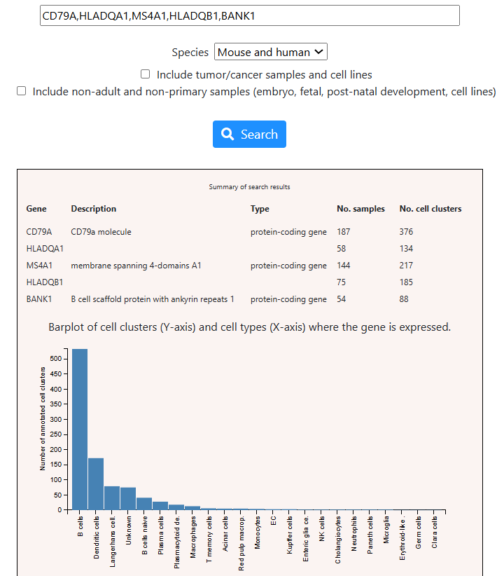

```{r setup, include=FALSE}
knitr::opts_chunk$set(echo = TRUE)
htmltools::HTML("
<style>
.indented {padding-left: 100px;}
</style>
")
```

## Seurat

Seurat is an R package for analysing single-cell RNA-seq data. More info about the package can be found [here](https://satijalab.org/seurat/).\
The public dataset we will be working with today is part of SeuratData, which is a package that distributes datasets in Seurat-object form.

```{r seurat_setup, include=FALSE}
if (!requireNamespace("Seurat", quietly = TRUE)) {
  install.packages('Seurat')
}

if (!requireNamespace("remotes", quietly = TRUE)) {
  install.packages("remotes")
}
if (!requireNamespace("SeuratData", quietly = TRUE)) {
  remotes::install_github("satijalab/seurat-data", quiet = TRUE)
}
if(!requireNamespace("patchwork", quietly = TRUE)) {
  install.packages("patchwork")
}
```

```{r load_libraries, include=FALSE}

library(Seurat)
options(Seurat.object.assay.version = "v5")
library(SeuratData)
library(patchwork)

```

## Single-cell Analysis Overview

### Overview:

#### 1. Acquiring single cells and sequencing them <button class="btn btn-secondary btn-xs" type="button" data-toggle="collapse" data-target="#acq">More</button>

::: {#acq .collapse}
Acquiring single cells entails dissociating some individual cells from tissue:

-   droplet-based: higher throughput (aka higher \# of individual cells you are sequencing), lower depth -\> good for main transcriptional patterns
-   plate-based: higher depth for fewer cells, useful for lowly expressed transcripts
:::

#### 2. Raw data processing: Processing reads to counts per cell (count matrix) <button class="btn btn-secondary btn-xs" type="button" data-toggle="collapse" data-target="#raw">More</button>

::: {#raw .collapse}
Acquired sequencing data, output of raw data processing: genes x single cells count matrix in scRNA-seq:

-   high-dimensional data, a lot of rows (whole transcriptome) and columns (lots of cells)
-   very sparse, signal spread out, characteristic of droplet-based approach
:::

#### 3. Data pre-processing:

```{=html}
<style>
.indented {padding-left: 20px;}
</style>
```

##### 3.1. Quality Control (filtering out poor quality cells) <button class="btn btn-secondary btn-xs" type="button" data-toggle="collapse" data-target="#qc">More</button> {.indented}

::: {#qc .collapse}
-   As a result of the wet-lab technique, our droplet could be:
    -   singlet (what we want): one cell in a droplet
    -   empty: no cell in a droplet; since ambient RNA exists, it won't be an empty column
    -   doublet: has one (or more) cells in a droplet -\> `DoubletFinder`
    -   dead cell: can recognise by higher % of reads mapped to genes are mapped to the mitochondrial genome; because we have so many cells, we can remove all cells with a more stringent cutoff % e.g. \>5% of all genes mapping to that mitochondrial genome (look at the data to pick a cutoff, vioolin plots quite useful)
-   Cell Ranger has proprietary software package (that you will have run as their customer), and they provide you with the count matrix and do the pre-processing part for you (up until, and including, QC)
:::

##### 3.2. Normalization <button class="btn btn-secondary btn-xs" type="button" data-toggle="collapse" data-target="#norm">More</button> {.indented}

::: {#norm .collapse}
-   Some cells will be sequenced to a bigger depth than other cells, (cell of type A got 1000 reads, cell of type B got 500 reads e.g.) -\> apply size factor for each cell to make it comparable
:::

##### 3.3. Feature Selection <button class="btn btn-secondary btn-xs" type="button" data-toggle="collapse" data-target="#feat">More</button> {.indented}

::: {#feat .collapse}
-   genes with low or no expression - exclude, reasoning: won't be crucial in cell type identity
-   housekeeping genes - exclude, they are expressed at a stable level in every cell type all the time, doesn't help in determining cell types -\> you care about 3000\~5000 most variable usually
:::

##### 3.4. Dimension Reduction <button class="btn btn-secondary btn-xs" type="button" data-toggle="collapse" data-target="#dim">More</button> {.indented}

::: {#dim .collapse}
-   PCA: 30 to 50 PCs instead of 20k you had before for genes; preserves major sources of variability, as it is expected some genes will have correlated behaviours; downstream steps will take the PCs as input -\> not best way for visualisation, but is a sanity check that something isn't horribly messed up
:::

##### 3.5. Data Correction <button class="btn btn-secondary btn-xs" type="button" data-toggle="collapse" data-target="#corr">More</button> {.indented}

::: {#corr .collapse}
-   batch effect correction: these cells can be from e.g. different people, or sequenced on different days, need to differentiate between batch effect and biological effect
-   tools: Matching mutual nearest neighbours (MNN), Canonical correlation analysis (CCA), Harmony
:::

##### + Visualisations along the way <button class="btn btn-secondary btn-xs" type="button" data-toggle="collapse" data-target="#vis">More</button> {.indented}

::: {#vis .collapse}
-   UMAP (non-linear dimensional reduction, non-deterministic) gives local preservation, meaning similar cells are grouped cells together (each dot is a cell), but not good at global structure, meaning just because cluster1 is further away from cluster3 than cluster2 is, doesn't mean cluster2 and cluster 3 are more similar in cell type than cluster1 and cluster3; not good for downstream analysis, just good for visualisation; PCA was input, otherwise the UMAP is really slow
:::

#### 4. Downstream analysis:

<!-- -->

##### 4-a) Clustering <button class="btn btn-secondary btn-xs" type="button" data-toggle="collapse" data-target="#clust">More</button> {.indented}

::: {#clust .collapse}
-   idea: similar cells (aka cells of same cell type) will cluster together
-   Two most popular clustering algorithms, both have a resolution parameter, the higher, more clusters:
    -   Leiden clustering (faster and usually leads to better clusters)
    -   Louvain clustering (Seurat default)
:::

##### 4-b) Cell type annotation <button class="btn btn-secondary btn-xs" type="button" data-toggle="collapse" data-target="#anno">More</button> {.indented}

::: {#anno .collapse}
-   label the clusters based on different biological functions (aka seen through highly expressed genes)
-   can be manual or automatic
-   can be of a main or fine labelling (more specific biological calls e.g. CD4 CTL and CD4 Naive instead of CD4 T)
-   Seurat does cluster resolution (higher acc), SingleR does cell per cell annonation, (usually lower acc)
:::

##### 4-c) Proportion test <button class="btn btn-secondary btn-xs" type="button" data-toggle="collapse" data-target="#prop">More</button> {.indented}

::: {#prop .collapse}
-   once you have cell types annotated, are there difference in the proportions of cell types in our control vs case
:::

##### 4-d) Differential expression <button class="btn btn-secondary btn-xs" type="button" data-toggle="collapse" data-target="#diff">More</button> {.indented}

::: {#diff .collapse}
-   determining which genes are differentially expressed when comparing e.g. two clusters, or a cluster with the rest of the clusters
:::

##### 4-e) Gene Ontology <button class="btn btn-secondary btn-xs" type="button" data-toggle="collapse" data-target="#go">More</button> {.indented}

::: {#go .collapse}
-   with a gene list of e.g. differentially expressed genes, whether they are related (and enriching) a pathway/process
-   R package: clusterProfiler
:::

##### 4-f) Trajectory inference cell states <button class="btn btn-secondary btn-xs" type="button" data-toggle="collapse" data-target="#time">More</button> {.indented}

::: {#time .collapse}
-   inferring pseudo time: it looks like cell state A and cell state B are two cell states of the same cell, and they are going through time
-   tool: Monocle
:::

##### 4-g) Cell-cell interaction <button class="btn btn-secondary btn-xs" type="button" data-toggle="collapse" data-target="#int">More</button> {.indented}

::: {#int .collapse}
-   to understand interactions between cell types
-   tool: CellPhoneDB
:::

<!-- -->

<!-- empty heading to end scope of "indented"  -->

#### 

Seurat v5: full process automatic data pre-processing: QC - Normalisation - feature selection - dimension red - data correction (batch effect removal with CCA), with some downstream analysis

## Case study

### Acquiring the data

This public dataset includes single-cell RNA-seq data of human peripheral blood mononuclear cells (PBMCs) using multiple sequencing platforms. Only data that **passed quality control** are included in the `pbmcsca` dataset.

```{r acquire_data, message=FALSE, warning=FALSE}
InstallData("pbmcsca")
data("pbmcsca")
# needs to update Seurat object to new structure (v5) for storing data/calculations
pbmcsca <- UpdateSeuratObject(pbmcsca)
```

Let's view a summary of the data:

```{r data_acquisition_overview, message=FALSE}
table(pbmcsca$Method)
```

We see the number of cells sequenced per sequencing platform.\
We are going to focus on single-cell sequencing of peripheral blood mononuclear cells (PBMC) from two patients, sequenced on two different platforms: 10x Chromium (v2) and 10x Chromium (v3)

```{r data_subset}
pbmc_10x_v2 <- pbmcsca[,pbmcsca$Method == "10x Chromium (v2)"]
pbmc_10x_v3 <- pbmcsca[,pbmcsca$Method == "10x Chromium (v3)"]
pbmc_combo <- pbmcsca[,pbmcsca$Method %in% c("10x Chromium (v2)", "10x Chromium (v3)")]
```

A Seurat object is a representation of single-cell expression data for R. Each Seurat object consists of one or more Assay objects aka representations of expression data (eg. RNA-seq, ATAC-seq, etc). Each assay can have multiple layers. Each layer would be a transformed version of the raw gene expression data. These assays can be reduced from their high-dimensional state to a lower-dimension state and stored as `DimReduc` objects.

Seurat objects also store additional metadata. The object is designed to be as self-contained as possible and as more information is put within the object, the larger it becomes in size.

```{r exploring_seurat_raw_cnt_matrix}

pbmc_10x_v3@assays$RNA #raw count matrix (genes x cells) of scRNA-seq 
```

```{r exploring_seurat_cell_info}
head(pbmc_10x_v3@meta.data) # info and labels of each cell
```

```{r exploring_seurat_dim_red}
pbmc_10x_v3@reductions #dim red info is here; empty, because we haven't done any dim reductions on the assay, so there is nothing to store!

```

### Analysis of a single scRNA-seq experiment

For now, let's focus on just the patient sample sequenced on 10x Chromium (v3).

```{r v3_dimensions}
dim(pbmc_10x_v3)
```

We have 3222 cells and 33694 genes that have passed quality control.

#### Normalisation

By default, Seurat implements a global-scaling normalization method called `LogNormalize`. Global-scaling means it aims to make your samples (for us, cells) comparable. `LogNormalize` normalises the gene expression measurements **for each cell** by the total number of counts across all genes **per cell**, and multiplies this by a scaling factor (10,000 by default), then log transforms the result using `log1p` (i.e $log_e(value+1)$):

```{r log_normalise, warning=FALSE}
pbmc_10x_v3 <- Seurat::NormalizeData(object=pbmc_10x_v3, normalization.method = "LogNormalize", 
    scale.factor = 10000)

```

How we could check we understand what `LogNormalize` does:

```{r check_lognormalize}

counts_of_first_cell <- pbmc_10x_v3@assays$RNA@counts[,1]
total_num_counts_first_cell <- sum(counts_of_first_cell)
base::all.equal(pbmc_10x_v3@assays$RNA@data[,1],
                log1p(counts_of_first_cell*10000/total_num_counts_first_cell)) # testing ‘near equality’ for numeric; Differences smaller than tolerance are not reported. The default value is close to 1.5e-8.

```

#### Feature Selection and Scaling

We use the `FindVariableFeatures()` Seurat function to select highly variable genes which have most of the useful information needed for downstream analysis. For now, there is nothing there:

```{r }
pbmc_10x_v3@assays$RNA@var.features
```

Here we select the top 3,000 most variable genes to save some computing time. In practice, you can select more genes (5,000 or more) to preserve more information from the scRNA-seq experiment:

```{r HVGs}
pbmc_10x_v3 <- Seurat::FindVariableFeatures(pbmc_10x_v3, selection.method = "vst", nfeatures = 3000)
head(pbmc_10x_v3@assays$RNA@var.features)
```

After feature selection, the downstream Seurat functions will only use these HVGs, unless otherwise specified.

<button class="btn btn-secondary btn-xs" type="button" data-toggle="collapse" data-target="#vst">

More on vst
</button>  

::: {#vst .collapse}
Variance stabilising transformation, or vst, is a method for fitting a line to the relationship of log(variance) and log(mean) using local polynomial regression (loess), then standardising the feature (aka gene expression) values using the observed mean and expected variance (given by the fitted line). Feature variance is then calculated on the standardised values after clipping to a maximum (see clip.max parameter). - as per Seurat documentation.\
We are searching for the highest variable genes. A way to do this would be to find the variance of each gene (using gene expr values across all cells), sort from highest to lowest and have a cutoff of the top 3000 genes. However, genes that have a higher expression will have a higher variance (and lower expression lower variance), meaning some genes will be in the cutoff even though they are not particulary variable, instead just due to how large of a number an observation (hence variance) can get to. So to make genes more comparable across variances with the diverse range of means, you want to standardise the expression values.\
When standardising the expression values, normally you would centre by the mean, and scale by the variance of each gene. But the variance could be noisy due to low number of samples -\> a sc count matrix is sparse! This is where the variance stabilising method comes in. So the idea is to "borrow" from other genes of a similar mean value by fitting a (loess) line to a scatter plot of log_mean x log_var pairs, and use the predicted (expected) value of log_var for each log_mean (aka use the stabilised variance) in standardising every gene expression value: $$\frac{gene\_expr\_value - mean}{\sqrt{predicted\_var}},$$ where $predicted\_var = e^{predicted\_log\_var}$. This stabilised variance talks about the expected variance given a certain mean, so by standardising with this stabilised variance, we will achieve in removing the mean-var dependency. For implementation details, see [here](https://github.com/satijalab/seurat/blob/868646df677f3680177fff6d2b9869ebc40499b9/R/preprocessing.R#L1333-L1359), and note when the `counts` or `data` slot is used for feature value standardisation.
:::  


Many downstream statistical analyses requires the data matrix to be centred and scaled. We use the Seurat function `ScaleData()` for this:  
```{r scaling}
pbmc_10x_v3 <- Seurat::ScaleData(pbmc_10x_v3)
```

The scaled z-scored residuals of these models are stored in the `scale.data` slot, and are used for downstream dimension reduction and clustering tasks.

#### Dimension Reduction - Principal component analysis (PCA)

We perform PCA on the **scaled data**. By default, HVGs in `pbmc_10x_v3@var.genes` are used as input, but they can be defined by specifying the argument `pc.genes`.

We run PCA on top 3,000 most variable genes, and the total number of PCs to compute and store is 50 by default:

```{r pca}
pbmc_10x_v3 <- Seurat::RunPCA(pbmc_10x_v3, features = VariableFeatures(object = pbmc_10x_v3))
```

The PCA result is stored in `pbmc_10x_v3@reduction`. The output information prints us 30 (by default) genes that are positively, or negatively correlated with the top 5 (by default) principal components.

<button class="btn btn-secondary btn-xs" type="button" data-toggle="collapse" data-target="#pca">  

More on PCA non-determinism
</button>

::: {#pca .collapse}
The default parameters instill for PCA to be approximated by using truncated singular value decomposition and fixed with a random seed preset to 42. Under the hood, it is using the `irlba` package for truncated singular value decomposition (SVD) that uses an iterative algorithm that starts with a *random* initial vector to approximate the largest singular vectors.

:::  


**Important note:** How many genes to choose for PCA and how many PCs to use for downstream analysis is a complex and important issue that is out of the scope of today’s workshop.

But we highly recommend you to read this [document](https://learn.gencore.bio.nyu.edu/single-cell-rnaseq/seurat-part-3-data-normalization/) before analyzing your own scRNA-seq data, where the authors show how to use some visualization methods to guide your choice.

#### Visualisation - 2D UMAP
Uniform manifold approximation and project (UMAP) is a tool for visualising higher dimensional data. It takes PCs as input. Here we use the top 30 PCs:
```{r run_umap, message=FALSE}
pbmc_10x_v3 <- Seurat::RunUMAP(pbmc_10x_v3, dims=1:30)
```

We draw the UMAP plot with the `Dimplot()` function by specifying the argument reduction = 'umap'. We can colour points (cells) by using the metadata information (pbmc_10x_v3@meta.data) by specifying the argument `group.by`:
```{r plot_umap}
Seurat::DimPlot(pbmc_10x_v3, reduction = "umap", label = TRUE, group.by = 'Method')
```

The `Method` metadata refers to the sequencing platform used, and as we are currently analysing the data from only one sequencing platform, we are expecting to see all the cells labelled with the same colour.

<button class="btn btn-secondary btn-xs" type="button" data-toggle="collapse" data-target="#num_pcs_umap">  

More on #PCs influencing UMAP
</button>
::: {#num_pcs_umap .collapse}
```{r umaps, message=FALSE}
pbmc_10x_v3 <- Seurat::RunUMAP(pbmc_10x_v3, dims = 1:2)
p1 <- Seurat::DimPlot(pbmc_10x_v3, reduction = "umap", group.by = 'Method') + Seurat::NoLegend()
pbmc_10x_v3 <- Seurat::RunUMAP(pbmc_10x_v3, dims = 1:10)
p2 <- Seurat::DimPlot(pbmc_10x_v3, reduction = "umap", group.by = 'Method') + Seurat::NoLegend()
pbmc_10x_v3 <- Seurat::RunUMAP(pbmc_10x_v3, dims = 1:30)
p3 <- Seurat::DimPlot(pbmc_10x_v3, reduction = "umap", group.by = 'Method') + Seurat::NoLegend()
pbmc_10x_v3 <- Seurat::RunUMAP(pbmc_10x_v3, dims = 1:50)
p4 <- Seurat::DimPlot(pbmc_10x_v3, reduction = "umap", group.by = 'Method') + Seurat::NoLegend()
# combining plots by patchwork system

p1 + p2 + p3 + p4
```

Two PCs aren't enough to see any structure and this would be because the first 2 PCs don't capture enough variability in the data. The first 30 and 50 seem to give quite similar UMAP visualisations.  
To get the legend font to be smaller in size, I searched the documentation for `DimPlot` and didn't find a specific parameter for it, however, there was `...`, which means you can send through parameters that would be used by the functions `DimPlot` employs. Looking at the [implementation](https://github.com/satijalab/seurat/blob/main/R/visualization.R) of `DimPlot`, I saw there is `NoLegend()`, so I instead decided to remove the legend for each individual plot using `+NoLegend()`
:::

#### Clustering
By default, Seurat uses the Louvain algorithm. Another popular one is Leiden algorithm.  
The Louvain algorithm requires a neighbor graph as input. Therefore, we first run the `FindNeighbors()` function first. It is based on PCs, so here we use the 30 top PCs (previously, we conducted PCA with the default number of PCs being 50). We then run the `FindClusters()` function for clustering. The argument `Algorithm=1` means we are using the Louvain algorithm for clustering:

```{r clustering}
pbmc_10x_v3 <- Seurat::FindNeighbors(pbmc_10x_v3, dims = 1:30)
pbmc_10x_v3 <- Seurat::FindClusters(object = pbmc_10x_v3, resolution = 0.3, algorithm=1)
```

The key tunning parameter here is resolution, which determines how many clusters we get. The number of clusters to have depends on biology. The higher the number, the more clusters. 

We can use UMAP to visualise the clustering results. The argument `group.by='seurat_clusters'` is used to colour the cells according to the clustering results.
```{r plot_clusters}
Seurat::DimPlot(pbmc_10x_v3, reduction = "umap", label = TRUE, group.by = 'seurat_clusters')
```

#### Cell Type Annotation
Above we see that cluster 3 is visually its own cluster. To see what characterises that cluster, we can look at its marker genes. Marker genes would be the genes that are differentially expressed in ONLY that cluster, aka we compare that cluster to all the other clusters **together**. 
```{r markergenes}
pbmc_10x_v3.markers <- FindAllMarkers(pbmc_10x_v3, min.pct = .25, logfc.threshold = .25)

cluster3.markers <- pbmc_10x_v3.markers[which(pbmc_10x_v3.markers$cluster==3),]
cluster3.markers[1:5,]
```
We then search these marker genes in this [database website](https://panglaodb.se/search.html). If there are genes with a dash in their name, you need to remove the dash before searching.



Based on the result provided by the database, it looks like cluster 3 might be a cluster of B cells. This is a rare situation in which we can check whether this is the case by checking the cell-type ground truth information pre-saved in the `pbmc_10x_v3` object, and plotting this as UMAP:
```{r ground_truth}
DimPlot(pbmc_10x_v3, reduction = "umap", label = TRUE, group.by = 'CellType')
```

And so we see that cluster 3 (in our previous UMAP) is labelled as B cells, as we got from the database using our marker genes.

##### Annotating datasets
Very often we might have a few genes of interest, say CD14, a marker of CD14+ monocytes. Then we can look for clusters where CD14 is up-regulated. This can be done by:
```{r cd14}
Idents(object = pbmc_10x_v3) <- "seurat_clusters"
VlnPlot(pbmc_10x_v3, features = 'CD14')
```

So, cluster 4 is high likely to be annotated as CD14+ monocytes.

Typically, cell-type information is unknown in single cell data, as this is what we are trying to find out! But publicly available datasets may have been previously annotated using the technique highlighted above, or using other reference datasets.

#### Automatic Cell Type Annotation for `pbmc_10x_v2`
Suppose we have annotated `pbmc_10x_v3`. We can then use it as a reference to annotate a new PBMC dataset (like `pbmc_10x_v2`). This can be done computationally, so that we do not need to go through the process of clustering, finding differentially expressed genes and looking up gene names.

**Remember**: `pbmc_10x_v2` and `pbmc_10x_v3` include different cells from different patients and sequenced using different platforms.

##### Pre-processing and Visualization for `pbmc_10x_v2`

```{r pbmcv2, message=FALSE}
# Normalise it
pbmc_10x_v2 <- NormalizeData(pbmc_10x_v2)

# Feature Selection
pbmc_10x_v2 <- FindVariableFeatures(pbmc_10x_v2, selection.method = "vst", nfeatures = 3000)

# Scale it
pbmc_10x_v2.all.genes <- rownames(pbmc_10x_v2)
pbmc_10x_v2 <- ScaleData(pbmc_10x_v2, features = pbmc_10x_v2.all.genes)

# Do PCA
pbmc_10x_v2 <- RunPCA(pbmc_10x_v2, features = VariableFeatures(object = pbmc_10x_v2))

# Draw UMAP
pbmc_10x_v2 <- FindNeighbors(pbmc_10x_v2, dims = 1:30)
pbmc_10x_v2 <- RunUMAP(pbmc_10x_v2, dims=1:30)
DimPlot(pbmc_10x_v2, reduction = "umap", label = TRUE, group.by = 'Method')
```

##### Cell Type Annotation Using `pbmc_10x_v3` as Reference

In Seurat we can learn cell type annotation results from one scRNA-seq data to provide cell type annotation for another scRNA-seq dataset.

We use the `FindTransferAnchors()` function to predict which cells in two datasets are of the same cell type. Here we use `pbmc_10x_v3` as the reference data set, and `pbmc_10x_v2` is the query data.

We specify that we use the top 30 PCs, then assign the cell-type of the cells in `pbmc_10x_v2` using the `TransferData()` function:  
```{r transfer_anchors}
anchors <- FindTransferAnchors(reference = pbmc_10x_v3, query = pbmc_10x_v2, dims = 1:30)

predictions <- TransferData(anchorset = anchors, refdata = pbmc_10x_v3$CellType, dims = 1:30)
```

Seurat will provide a table with the most likely cell type and the probability of each cell type based on the existing cell types in the reference. This means if there is a cell type in `pbmc_10x_v2` that doesn't exist in the reference, we won't be able to correctly assign those cells, resulting in a misleading classification. 
We assign the most likely cell type to the `pbmc_10x_v2` object, and then use UMAP to visualise this annotation:

```{r celltype_annotation_using_pbmcv3}

pbmc_10x_v2@meta.data$CellType_Prediction <- predictions$predicted.id 

cell_type_pred_umap <- DimPlot(pbmc_10x_v2, reduction = "umap", label = FALSE, group.by = 'CellType_Prediction')
cell_type_pred_umap
```


##### Cell Type Annotation Using Azimuth
[Azimuth](https://azimuth.hubmapconsortium.org/) is a web application that uses an annotated reference dataset to automate the processing, analysis, and interpretation of a new single-cell RNA-seq or ATAC-seq experiment.

The input of Azimuth can be a Seurat object. In order to reduce the size of the uploaded file, we retain only the useful information for cell type annotation with the following command lines:
```{r azimuth_obj_creation}
DefaultAssay(pbmc_10x_v2) <- "RNA"
pbmc_10x_v2_simple <- DietSeurat(object = pbmc_10x_v2, assays = "RNA")
#saveRDS(pbmc_10x_v2_simple, 'output/pbmc_10x_v2.Rds')
```

An Rds file called `pbmc_10x_v2.Rds` is saved in your working directory. You can check where is your working directory by using the `getwd()` function.

How to use Azimuth for cell type annotation:

- Find ‘References for scRNA-seq Queries’ -> Then find ‘Human - PBMC’ -> click ‘Go to App’
- Click ‘Browse’ -> find ‘pbmc_10x_v2.Rds’ at your working directory -> Click ‘Open’
- Wait for the Rds file to upload to the website
- Click ‘Map cells to reference’
- Click ‘Download Results’
- Find ‘Predicted cell types and scores (TSV)’
- Click ‘Download’ to get the cell type annotation result stored in azimuth_pred.tsv
- Copy the tsv file (azimuth_pred.tsv) to your R working directory

The tsv file has the same data structure of Seurat annotation result (predictions). We read the tsv file, then add the annotation result to the pbmc_10x_v2 object with the `AddMetaData()` function and we use UMAP to visualise the cell type annotation result from Azimuth:
```{r azimuth_preds}
azimuth_predictions <- read.delim('azimuth_pred.tsv', row.names = 1)
pbmc_10x_v2 <- AddMetaData(object = pbmc_10x_v2, metadata = azimuth_predictions)
cell_type_azimuth_umap <- DimPlot(pbmc_10x_v2, reduction = "umap", label = FALSE, group.by = 'predicted.celltype.l2')
cell_type_azimuth_umap
```

##### Comparing annotations
Here is the cell type annotation results provided by the data provider:
```{r ground_truth_plot}
cell_type_truth_umap <- DimPlot(pbmc_10x_v2, reduction = "umap", label = FALSE, group.by = 'CellType')
cell_type_truth_umap
```

Assuming the ground truth of the cell type annotation is from the provider, we can see that the cell type annotation provided from Azimuth is better than from Seurat, which would be due to Azimuth using a larger reference dataset, enabling Azimuth to learn the characteristics of more cell types. 


